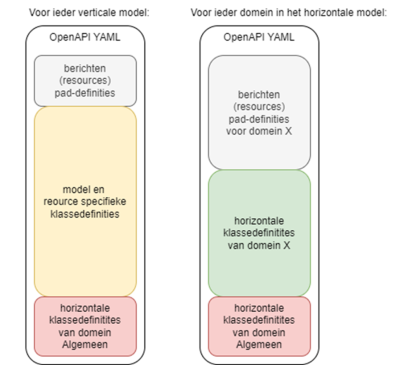

# VERA-openapi

#### Inhoud

- [Inleiding](#Inleiding)
- [Viewers](#Viewers)
- [Toelichting](#Toelichting)
- [Definities](#Definities)
- [Toepassing](#Toepassing)

## Inleiding
De mappen **Informatiedomeinen** en **Ketenprocessen** bevatten alle OpenAPI-specificaties (YAML).
Alle overige bestanden in deze repo (in de root en in map 'docs') zijn enkel bedoeld voor documentatie en horen niet bij de opleverset.
Op deze pagina staat een toelichting op de totstandkoming en toepassing van de API's.
> :warning: **LET OP:** deze publicatie is geen officiële release, maar een aanloop naar VERA 4.0. 
Er kunnen derhalve geen rechten aan ontleend worden. Opmerkingen zijn hartelijk welkom. Graag hiervoor een 'Issue' aanmaken (zie 2e menu links-boven).

## Viewers
Hieronder staan links naar SwaggerUI views op de API's. 
Let op: de API's voor de **Informatiedomeinen** zijn afgeleid van het **horizontale** gegevensmodel. De API's voor de **Ketenprocessen** horen bij de **verticale** gegevensmodellen.
Zie ook de toeliching hieronder.
> :bulb: **Tip:** in Markdown worden links niet in een nieuwe pagina geopend. Als je een view opent, navigeer dan terug om weer op deze pagina te komen.

### Ketenprocessen
- [Casemanagement](https://vereniging-corponet.github.io/vera-openapi/Ketenprocessen/BDO.html)
- [Beheer Financiële gegevens](https://vereniging-corponet.github.io/vera-openapi/Ketenprocessen/BFG.html)
- [Beheer Overeenkomstgegevens](https://vereniging-corponet.github.io/vera-openapi/Ketenprocessen/BOG.html)
- [Beheer Relatiegegevens](https://vereniging-corponet.github.io/vera-openapi/Ketenprocessen/BRG.html)
- [Beheer Vastgoedgegevens](https://vereniging-corponet.github.io/vera-openapi/Ketenprocessen/BVG.html)
- [Incasso](https://vereniging-corponet.github.io/vera-openapi/Ketenprocessen/INC.html)
- [Kwaliteitsmanagement](https://vereniging-corponet.github.io/vera-openapi/Ketenprocessen/KMT.html)
- [Onderhouden Eenheden](https://vereniging-corponet.github.io/vera-openapi/Ketenprocessen/OHD.html)
- [Verhuren Eenheden](https://vereniging-corponet.github.io/vera-openapi/Ketenprocessen/VHE.html)
- [Woonruimteverdeling](https://vereniging-corponet.github.io/vera-openapi/Ketenprocessen/WRV.html)

## Toelichting
Het gegevensmodel van VERA kent verticale modellen en een horizontaal model. Het horizontale model is de meest rijke verzameling aan klassen en velden per klasse (klassen en velden worden binnen Novius aangeduid met: entiteitstypes en attribuuttypes, dat nemen we hier over). De verticale modellen richten zich op specifieke ketenprocessen en bevatten alleen die entiteiten en attributen die relevant zijn binnen een proces. Ze bevatten een selectie van entiteiten uit de horizontale verzameling, en per entiteit vaak weer een selectie aan attributen. ​

De entiteiten uit alle modellen (zowel de verticale als horizontale) zijn verdeeld in Informatiedomeinen. Een Informatiedomein is een clustering op basis van een Bedrijfsfunctie. Een Bedrijfsfunctie heeft een 1 op 1 relatie met een Afdeling waarbinnen deze Bedrijfsfuncie valt, en daarmee met een Informatiemodel. Een Informatiemodel bevat dus functies met een sterk onderlinge cohesie.​

We leveren OpenAPI-specificaties op voor zowel de Informatiedomeinen als voor de ketenprocessen. Hiervoor hanteren we onderstaande regels: ​

- We gebruiken OpenApi 3.0 om overerving (OO) op te lossen (oneOf/allOf). Afgeleide klassen zijn alleen opvraagbaar via de basis-entiteit (ook wel aangeduid met superentiteit). ​

- Voor de verticale modellen (ketenprocessen) leveren we per model een API-specificatie.​

- Voor het horizontale model leveren we per Informatiedomein een API-specificatie.​

- Zelfde entiteitstypen kunnen binnen hetzelfde verticale model per resource (bericht) een verschillende definitie hebben.​

- In een API-specificatie voor een ketenproces zijn voor de berichten alle definities van afhankelijke entiteitstypen opgenomen, ongeacht het informatiedomein waartoe ze horen. Entiteiten uit de horizontale modellen zijn als URI opgenomen met uitzondering voor entiteiten uit Algemeen (Referentiedata en Sturingslabels), die worden wel embbedded opgenomen.

- Voor een API-specificatie van een Informatiedomein geldt dat verwijzingen naar resources uit andere Informatiedomeinen niet embedded opgenomen worden, maar als referentie (URI). Hiervoor geldt het architectuurprincipe dat systemen uit verschillende Informatiedomeinen zich via API’s verbinden.​

- In de API-specificaties worden voor sleutelvelden van een entiteitstype (de kerngegevens) nieuwe entiteitstypen gegenereerd met als naam de daam van de entiteit gevolgd door '-sleutels'. Deze zitten dus alleen in de API-specificaties en zijn niet het canonieke model terug te vinden.

- Ook Informatiedomein Algemeen heeft een eigen API-specificatie.​

- Enumaraties: de wens is om referentiedata voor soorten van afgeleide klassen als enumeratie op te nemen (bijvoorbeeld: relatie.soort overeenkomst.soort)
- Metadata (limiet aantal entiteiten in response, verzendende organisatie, tijdstip bericht, etc.) zit niet in de 'payload' maar wordt in de header meegestuurd.

## Definities

- in de verticale API's worden de entiteiten geprefixt met de naam van de resource

- in de horizontale API's worden entiteiten zonder prefix opgenomen

## Toepassing

Binnen Informatiedomeinen bevinden zich applicaties/systemen met functies die sterk onderling verwand zijn. Dit worden ook wel kernpakketten genoemd. Bijvoorbeeld een relatiebeheerpakket. Voor deze kernpakketten zijn er de horizontale API's.

De verticale API's zijn voor (sub)systemen die een ketenproces implementeren. Deze subsystemen agregeren (mogelijk) informatie uit kernpakketten via horizontale API's.

### Informatiedomeinen
- [Algemeen](https://vereniging-corponet.github.io/vera-openapi/Informatiedomeinen/Algemeen.html)
- [Dossier](https://vereniging-corponet.github.io/vera-openapi/Informatiedomeinen/Dossier.html)
- [Financien](https://vereniging-corponet.github.io/vera-openapi/Informatiedomeinen/Financien.html)
- [Kwaliteit](https://vereniging-corponet.github.io/vera-openapi/Informatiedomeinen/Kwaliteit.html)
- [Onderhoud](https://vereniging-corponet.github.io/vera-openapi/Informatiedomeinen/Onderhoud.html)
- [Overeenkomsten](https://vereniging-corponet.github.io/vera-openapi/Informatiedomeinen/Overeenkomsten.html)
- [Projectontwikkeling](https://vereniging-corponet.github.io/vera-openapi/Informatiedomeinen/Projectontwikkeling.html)
- [Relaties](https://vereniging-corponet.github.io/vera-openapi/Informatiedomeinen/Relaties.html)
- [Vastgoed](https://vereniging-corponet.github.io/vera-openapi/Informatiedomeinen/Vastgoed.html)
- [Woonruimteverdeling](https://vereniging-corponet.github.io/vera-openapi/Informatiedomeinen/Woonruimteverdeling.html)

