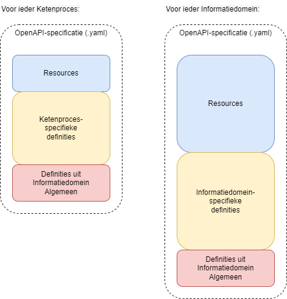

# vera-openapi

Het gegevensmodel van VERA kent verticale modellen en een horizontaal model. Het horizontale model is de meest rijke set aan klassen en velden per klasse (binnen Novius aangeduide met: entiteitstypes en attribuuttypes). De verticale modellen - die toegespitst zijn op een specifieke procesketen - bevatten alleen die klassen en velden die relevant zijn binnen het proces. Ze bevatten een selectie uit de horizontale verzameling van klassen, en per klasse vaak weer een selectie aan velden. ​

De klassen uit alle modellen (zowel de verticale als horizontale) zijn verdeeld in Informatiedomeinen. Een Informatiedomein is een clustering op basis van een bedrijfsfunctie. Een bedrijfsfunctie heeft een 1 op 1 relatie met een Afdeling waarbinnen deze funcies vallen en daarmee met een Informatiemodel. Een informatiemodel bevat functies met een sterk onderlinge cohesie. ​

We leveren OpenAPI-specificaties voor de (horizontale) Informatiedomeinen en (verticale) procesketens. Hiervoor hanteren we onderstaande regels: ​

- We gebruiken OpenApi 3.0 om polymorfisme op lossen (oneOf/allOf). Afgeleide klassen zijn alleen opvraagbaar via de basisklasse (superentiteit). ​

- Voor de verticale modellen (procesketens) leveren we per model een API-specificatie.​

- Voor het horizontale model leveren we per Informatiedomein een specificatie.​

- Zelfde entiteitstypen kunnen binnen een verticaal model verschillende definities hebben; namelijk een definitie per bericht (resource).​

- In een API-specificatie voor een procesketen zijn voor de berichten alle definities van afhankelijke entiteitstypen opgenomen, ongeacht het informatiedomein waartoe ze horen. Entiteiten uit de horizontale modellen worden als URI opgenomen, met uitzondering van de klassen uit Algemeen (Referentiedata en Sturingslabels), die worden wel embbedded opgenomen.

- Voor een API-specificatie van een Informatiedomein geldt dat verwijzingen naar resources uit andere Informatiedomeinen niet embedded opgenomen worden, maar als referentie (URI). Hiervoor geldt het architectuurprincipe dat systemen uit verschillende Informatiedomeinen zich via API’s verbinden.​

- In de API-specificaties worden voor sleutelvelden van een entiteitstype (voorheen kerngegevens) nieuwe entiteitstypen gegenereerd met als naam de daam van de entiteit gevolgd door '-sleutels'.

- Ook Informatiedomein Algemeen heeft een eigen API-specificatie.​

- Enumaraties: de wens is om referentiedata voor soorten van afgeleide klassen als enumeratie op te nemen (bijvoorbeeld: relatie.soort overeenkomst.soort)

## Definities

- in de verticale API's worden de entiteiten geprefixt met de naam van de resource

- in de horizontale API's worden entiteiten zonder prefix opgenomen

## Toepassing

Binnen Informatiedomeinen bevinden zich applicaties/systemen met functies die sterk onderling verwand zijn. Dit worden ook wel kernpakketten genoemd. Bijvoorbeeld een relatiebeheerpakket. Voor deze kernpakketten zijn er de horizontale API's.

Voor (sub)systemen die een procesketen implementeren en (eventueel) zijn er de verticale API's. Deze subsystemen agregeren (mogelijk) informatie uit kernpakketten via de horizontale API's.

