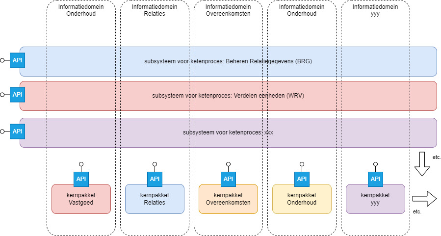

# VERA-OpenAPI

### Inhoud
- [Inleiding](#Inleiding)
- [Viewers](#Viewers)
- [Toelichting](#Toelichting)
- [Definities](#Definities)
- [Toepassing](#Toepassing)
- [Implementatiestandaarden](#Implementatiestandaarden-VERA)
- [Referentiedata](#Referentiedata)

## Inleiding
De mappen **Informatiedomeinen** en **Ketenprocessen** bevatten alle OpenAPI-specificaties (YAML).
Alle overige bestanden in deze repo (in de root en in map 'docs') zijn enkel bedoeld voor documentatie en horen niet bij de opleverset.
Op deze pagina staat een toelichting op de totstandkoming en toepassing van de API's.

## Viewers
Hieronder staan links naar SwaggerUI views op de API's. 
Er zijn API's voor de gevensmodellen horend bij **Informatiedomeinen** en **Ketenprocessen**.
Zie ook de toeliching hieronder.
> :bulb: **Tip:** in Markdown worden links niet in een nieuwe pagina geopend. Als je een view opent, navigeer dan terug om weer op deze pagina te komen.

### Ketenprocessen
|Ketenproces |Wiki pagina|
|-----|--------|
|[Casemanagement](https://aedes-datastandaarden.github.io/vera-openapi/Ketenprocessen/BDO.html)|[Wiki](https://cora.wikixl.nl/index.php/Id-e343225f-426a-e16c-194a-a1543ffcedb8)|
|[Beheer Financiële gegevens](https://aedes-datastandaarden.github.io/vera-openapi/Ketenprocessen/BFG.html)|[Wiki](https://cora.wikixl.nl/index.php/Id-30853da3-336e-6549-2f19-38f0690e77f5)|
|[Beheer Overeenkomstgegevens](https://aedes-datastandaarden.github.io/vera-openapi/Ketenprocessen/BOG.html)|[Wiki](https://cora.wikixl.nl/index.php/Id-b0387a07-5d2f-a9a3-06a1-5a26f4ad34f1)|
|[Beheer Relatiegegevens](https://aedes-datastandaarden.github.io/vera-openapi/Ketenprocessen/BRG.html)|[Wiki](https://cora.wikixl.nl/index.php/Id-9c203459-33f6-5a41-baa6-e68f92d28b8d)|
|[Beheer Vastgoedgegevens](https://aedes-datastandaarden.github.io/vera-openapi/Ketenprocessen/BVG.html)|[Wiki](https://cora.wikixl.nl/index.php/Id-153e76a5-78bc-d9ad-8b10-08409b2cfa61)|
|[Incasso](https://aedes-datastandaarden.github.io/vera-openapi/Ketenprocessen/INC.html)|[Wiki](https://cora.wikixl.nl/index.php/Id-9a188567-a9cb-9ff9-7f03-ea69d2a570a1)|
|[Kwaliteitsmanagement](https://aedes-datastandaarden.github.io/vera-openapi/Ketenprocessen/KMT.html)|[Wiki](https://cora.wikixl.nl/index.php/Id-be82da10-cb8d-de28-a04c-5457ef38dbe8)|
|[Onderhouden Eenheden](https://aedes-datastandaarden.github.io/vera-openapi/Ketenprocessen/OHD.html)|[Wiki](https://cora.wikixl.nl/index.php/Id-8854d1b3-afda-645f-8e54-87186dd7c19b)|
|[Verhuren Eenheden](https://aedes-datastandaarden.github.io/vera-openapi/Ketenprocessen/VHE.html)|[Wiki](https://cora.wikixl.nl/index.php/Id-e64d60f1-f63b-fd2c-4ab0-3b6b173ae5d1)|
|[Woonruimteverdeling](https://aedes-datastandaarden.github.io/vera-openapi/Ketenprocessen/WRV.html)|[Wiki](https://cora.wikixl.nl/index.php/Id-1e62e15e-324e-dbff-372e-d9564c5a317d)|

### Informatiedomeinen
|Informatiedomein|Wiki pagina|
|-----|--------|
|[Algemeen](https://aedes-datastandaarden.github.io/vera-openapi/Informatiedomeinen/Algemeen.html)|[Wiki](https://cora.wikixl.nl/index.php/Id-75cf48f9-bee3-9cd0-43d6-0b4140f3fb16)|
|[Dossier](https://aedes-datastandaarden.github.io/vera-openapi/Informatiedomeinen/Dossier.html)|[Wiki](https://cora.wikixl.nl/index.php/Id-b8b569d0-c382-5927-82e4-cdcba0655257)|
|[Financien](https://aedes-datastandaarden.github.io/vera-openapi/Informatiedomeinen/Financien.html)|[Wiki](https://cora.wikixl.nl/index.php/Id-4bccedd9-6307-d3b3-c464-d6564493cd0f)|
|[Kwaliteit](https://aedes-datastandaarden.github.io/vera-openapi/Informatiedomeinen/Kwaliteit.html)|[Wiki](https://cora.wikixl.nl/index.php/Id-f624fa76-79d1-7268-d10c-82582b90bd59)|
|[Onderhoud](https://aedes-datastandaarden.github.io/vera-openapi/Informatiedomeinen/Onderhoud.html)|[Wiki](https://cora.wikixl.nl/index.php/Id-c26eaadc-92ae-385c-33b0-ec7513a609fa)|
|[Overeenkomsten](https://aedes-datastandaarden.github.io/vera-openapi/Informatiedomeinen/Overeenkomsten.html)|[Wiki](https://cora.wikixl.nl/index.php/Id-37ab7422-77eb-56d0-a2b8-150ce264e85d)|
|[Projectontwikkeling](https://aedes-datastandaarden.github.io/vera-openapi/Informatiedomeinen/Projectontwikkeling.html)|[Wiki](https://cora.wikixl.nl/index.php/Id-52c10659-b9da-c240-ffa7-ad029a6b33f9)|
|[Relaties](https://aedes-datastandaarden.github.io/vera-openapi/Informatiedomeinen/Relaties.html)|[Wiki](https://cora.wikixl.nl/index.php/Id-0d74399c-6253-5994-9a5c-187f2bacb069)|
|[Vastgoed](https://aedes-datastandaarden.github.io/vera-openapi/Informatiedomeinen/Vastgoed.html)|[Wiki](https://cora.wikixl.nl/index.php/Id-d5f32972-bc8e-a4a2-2ddb-2fde55fb9f3b)|
|[Woonruimteverdeling](https://aedes-datastandaarden.github.io/vera-openapi/Informatiedomeinen/Woonruimteverdeling.html)|[Wiki](https://cora.wikixl.nl/index.php/Id-99995bab-2669-578e-149b-c167dbe8dc3d)|

### Gebruik VERA OpenAPI - Ketenproces Onderhouden Eenheden
Het ketenproces Onderhouden Eenheden is samen met [Ketenstandaard](https://www.ketenstandaard.nl) uitgewerkt en uitgebreid beschreven op de [WIKI](https://cora.wikixl.nl/index.php/Id-8854d1b3-afda-645f-8e54-87186dd7c19b) van Corponet. Dit ketenproces vormt de basis voor de berichten zoals opgenomen in de VERA OpenAPI-specificatie. Door de bundeling van kennis van beide organisaties is een proces tot stand gekomen die zowel voor de interne organisatie van de corporatie hanteerbaar is als ook in samenwerking met externe partijen zoals aannemers en onderhoudsbedrijven. 

De VERA OpenAPI-specificaties zijn bedoeld voor de uitwisseling van data tussen de **interne** systemen van de corporatie. Het bedrijfsproces Klantbediening binnen de corporatie kan bijvoorbeeld ingevuld zijn door een systeem die data uitwisseld met het onderhoudsysteem van de corporatie. Ook zijn er corporaties met een eigen onderhoudsdienst met vakmannen die (een deel van) het onderhoud van het eigen bezit verzorgen. In alle gevallen dat er uitwisseling plaatsvindt tussen de interne systemen van de corporatie kan dus gebruik gemaakt worden van VERA OpenAPI. 

Voor berichtuitwisseling met **externe** systemen van leveranciers zal gebruik gemaakt moeten worden van de DICO-berichten welke door Ketenstandaard wordt uitgegeven. Samen met VERA worden nieuwe DICO-berichten uitgewerkt die in lijn worden gebracht met de VERA OpenAPI-berichten zodat beide standaarden op elkaar aansluiten en compatibel met elkaar zijn. 
Voor de beschikbaarheid van de DICO-berichten verwijzen we naar de site van Ketenstandaard: https://ketenstandaard.nl/standaard/dico/ 
 

## Toelichting
VERA heeft een alles omvattend gegevensmodel en gegevensmodellen per Ketenproces. De gegevensmodellen per Ketenproces bevatten alleen die entiteiten - en per entiteit alleen die attributen - uit het alles omvattende model, die een rol spelen binnen de procescontext.
De entiteiten uit alle modellen zijn onderverdeeld in Informatiedomeinen. Een Informatiemodel bevat functies met een sterk onderlinge cohesie.​

We leveren OpenAPI-specificaties op voor zowel de Informatiedomeinen als voor de Ketenprocessen. Hiervoor hanteren we onderstaande regels: ​

- We gebruiken OpenApi 3.0 om overerving (OO) op te lossen (oneOf/allOf). Afgeleide klassen zijn alleen opvraagbaar via de basis-entiteit (ook wel aangeduid met superentiteit). ​

- Voor de Ketenprocessen leveren we per model een API-specificatie.​

- Voor het alles omvattende model leveren we per Informatiedomein een API-specificatie.​Hierin zijn alle entiteiten een bericht.

- Zelfde entiteitstypen kunnen binnen hetzelfde Ketenprocesmodel per bericht een andere definitie hebben.​

- In de API-specificatie van een Ketenproces worden alle afhankelijkheden opgenomen, ongeacht het Informatiedomein waartoe ze horen, met uitzondering van entiteiten uit Informatiedomein-API's die zonder restrictie gebruikt worden. Die worden als referentie (URI) opgenomen en moeten dus met aparte calls opgehaald worden. Uitzondering hierop vormen de entiteiten uit Informatiedomein Algemeen (Referentiedata, Sturingslabels, etc.), die worden wel opgenomen in iedere API.

- Voor een API-specificatie van een Informatiedomein geldt dat verwijzingen naar resources uit andere Informatiedomeinen niet embedded opgenomen worden, maar als referentie (URI). Hiervoor geldt het architectuurprincipe dat systemen uit verschillende Informatiedomeinen zich via API’s verbinden.​

- In de API-specificaties worden voor sleutelvelden van een entiteitstype (de kerngegevens) nieuwe entiteitstypen gegenereerd met als naam de naam van de entiteit gevolgd door '-sleutels'.

- Ook Informatiedomein Algemeen heeft een eigen API-specificatie.​

- Enumaraties: de wens is om referentiedata voor soorten van afgeleide klassen als enumeratie op te nemen (bijvoorbeeld: relatie.soort, overeenkomst.soort)

- Metadata (limiet aantal entiteiten in response, verzendende organisatie, tijdstip bericht, etc.) zit niet in de 'payload' maar wordt in de header meegestuurd. De headers worden altijd met een prefix aangegeven namelijk met X-headernaam, bijv. 'X-Stuurgegevens-TijdstipBericht'.

- Voor ophaal acties (GET operaties) op de verschillende klasses (bijv. Betalingsregeling) kunnen verschillende parameters meegestuurd worden om te kunnen sorteren op basis van het aantal (bijv. aantal betalingsregelingen) dat in het response wordt getoond. Dat kan met een parameter 'pagina' in de querystring of met de 'X-Parameters-Pagina' header. In beide gevallen kan een getal worden opgegeven om zo direct een specifieke pagina retour te krijgen. Afhankelijk van een optionele 'X-Parameters-AantalPerPagina' verschilt het aantal pagina's dat een verzoek teruggeeft. 

Alle ophaal acties ondersteunen daarnaast een cursor als querystring parameter. Hiermee kan een volgende pagina opgehaald worden. Deze cursor is te onttrekken uit een eerder response op de API. In dat response zit een X-Parameters-Cursor header die gebruikt kan worden om een volgende pagina op te halen. 

- In de VERA standaard en dus ook de VERA Open API is veel informatie aanwezig. Op de VERA Wiki is inzicht te vinden in deze informatie. Naast deze uitgebreide documentatie is middels onderstaande URL een Excel bestand te downloaden om eenvoudig als gebruiken te kunnen zoeken naar specifieke termen. De Excel bevat alle data over de verschillende informatiedomeinen, ketenprocessen en referentiedata. 

https://github.com/vereniging-corponet/vera-openapi/blob/main/docs/brongegevens.xlsx

- Voor de VERA API wordt aangesloten bij de Semantic versioning 2.0.0. Een gedetailleerde uitleg over de impact van de versies die uigebracht worden door VERA is hier te vinden: https://www.coraveraonline.nl/index.php/VERA_Release_en_versiebeleid

- in de API's van de ketenprocessen worden entiteiten geprefixt met de naam van de resource

## Toepassing
VERA defineert Informatiedomeinen als geheel van gerelateerde informatieobjecten en informatiebronnen. Een Informatiebron wordt ook wel aangeduid als Kernpakket. VERA levert hiervoor per Informatiedomein een API.

Daarnaast kent VERA zogenaamde ketenprocessen. Het subsysteem dat een ketenproces implementeert kan gegevens uit meerdere Informatiedomeinen nodig hebben. Hiervoor levert VERA per ketenproces een API.

## Implementatiestandaarden VERA
Naast de definitie van informatiedomeinen en ketenprocessen biedt VERA ook steeds meer standaarden rondom de implementatie van de gegevensuitwisseling. Deze standaarden bieden steeds meer zekerheid over de interoperabiliteit tussen systemen. Vanaf VERA 4.1.3 is de standaard rondom het gebruik van sleutels van objecten verder (id, idExtern, ..) uitgewerkt. Zie hiervoor de WIKI https://www.coraveraonline.nl/index.php/Richtlijnen#Identificatie_van_gegevensobjecten.

## Data API's

- In de VERA-standaard en dus ook de VERA Open API is veel informatie (data) aanwezig. Op de VERA Wiki is inzicht te vinden in deze informatie. Naast deze uitgebreide documentatie is middels onderstaande URL een Excel bestand te downloaden om eenvoudig als gebruiken te kunnen zoeken naar specifieke termen. De Excel bevat alle data over de verschillende informatiedomeinen, ketenprocessen en referentiedata. Het bestand is de bron van de totstandkoming van alle API's. 

https://github.com/vereniging-corponet/vera-openapi/blob/main/docs/brongegevens.xlsx

## Referentiedata

De VERA-standaard kent attributen die geen vrije waarde mogen hebben, maar alleen een waarde uit een waardeverzameling. Deze verzamelingen/lijsten zijn door VERA vastgelegd als Referentiedata. Lees meer hierover op: https://www.coraveraonline.nl/index.php/Referentiedata

Referentiedata bevindt zich in een eigen repository en wordt onafhankelijk van de OpenAPI-specificaties gereleased, zie: https://github.com/Aedes-datastandaarden/vera-referentiedata

Een overzicht van welke lijst gekoppeld is aan welke entiteit (cross reference) staat hier: https://aedes-datastandaarden.github.io/vera-openapi/referentiedatacrossreference.html

Let op: niet alle lijsten worden geleverd door VERA. In sommige gevallen wordt er verwezen naar bestaande lijsten, zoals ISO taal- en landcodes en anders heeft de leverancier vrijheid eigen codes te gebruiken.
